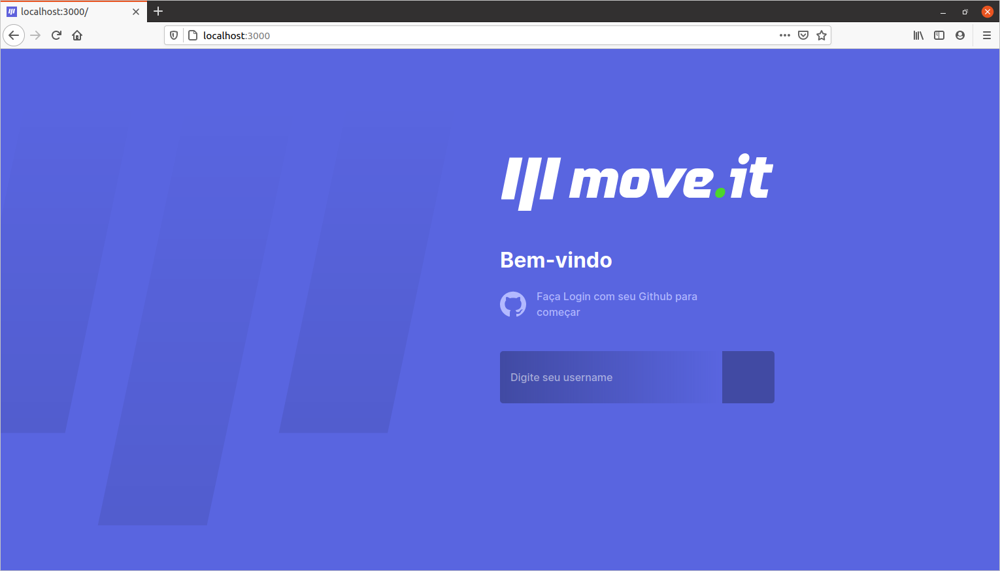
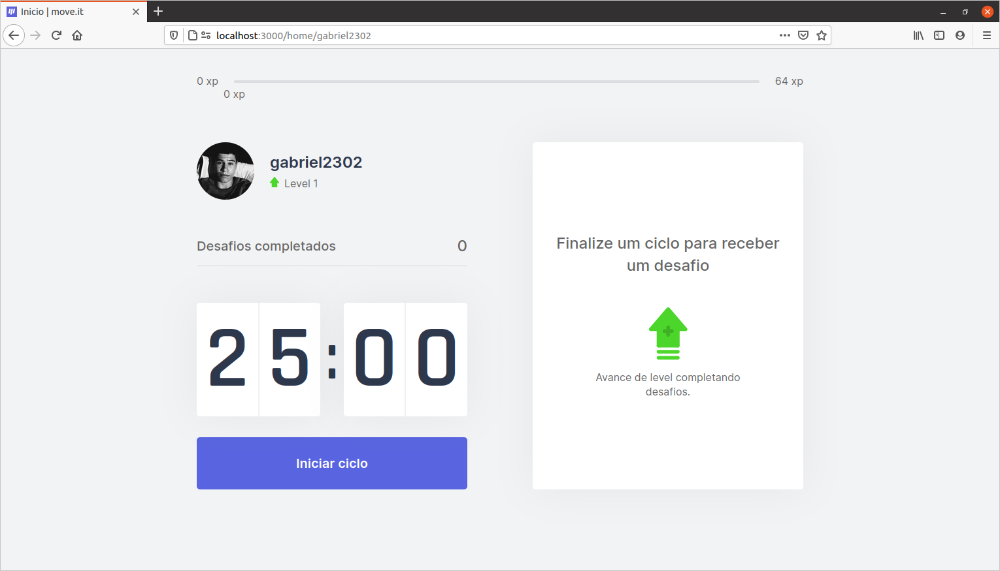

# Login screen

# Home screen

# Technologies used

- React
- Next JS
- Typescript

# Project

Is an app that combines Pomodoro's technique with physical exercises for those who spend a lot of time in front of the computer. Developed during NLW # 04, increasing the login screen and responsive design.

## Install project dependencies

`yarn`
or
`npm i`

## To run the project

`yarn dev`

Access `localhost:3000` in your browser.
